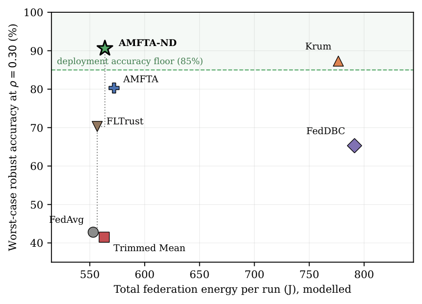

# Sustainable Byzantine-Robust Federated Learning for Smart-City IoT

[](LICENSE)
[](https://www.python.org/)
[](https://pytorch.org/)

Reference implementation for **"Sustainable Byzantine-Robust Federated Learning
for Resilient Smart-City IoT Systems."**

Federated intrusion detection lets a city train on its own traffic without
centralising it, and hands the aggregation server a problem it cannot solve from
a single round: telling a poisoned update apart from an unusual but honest one.
This repository studies that problem together with the one nobody prices — what
the defence costs the devices that run it.

---

## The result in one figure

Once a deployment accuracy floor is imposed, robustness and sustainability do not
trade off across the rules evaluated here. The data-free stateful trust rule is
the sole occupant of the frontier at ρ = 0.30.

<p align="center"></p>

---

## What the study covers

| | |
|---|---|
| Dataset | NF-TON-IoT — 9,195,116 train / 2,627,177 test flows, 41 NetFlow features |
| Clients | 100, Dirichlet α = 0.5, full participation |
| Attacker fractions | ρ ∈ {0.10, 0.20, 0.30} |
| Attack families | label flipping, Gaussian-noise model poisoning |
| Aggregation rules | FedAvg, Trimmed Mean, Krum, FLTrust, FedDBC, AMFTA, AMFTA-ND |
| Model | logistic regression, 41 features |
| Seeds | 42, 123, 456 |

Reported as: per seed, the mean over the final five rounds; across seeds, the
mean and **sample** standard deviation.

## Findings

| | |
|---|---|
| **Certified stability** | AMFTA-ND is the only rule whose degradation over ρ ∈ [0.10, 0.30] is *statistically contained* within a pre-declared 5 pp margin in both attack families. This is an equivalence test (TOST), not a null result — a non-significant difference is absence of evidence, not evidence of stability, and cells the design cannot resolve are reported as inconclusive |
| **No security/sustainability trade-off** | The gated Pareto frontier at ρ = 0.30 has one occupant. AMFTA-ND reaches 90.6% worst-case robust accuracy against Krum's 87.3% at 9.8% less total system energy, and has the best robust accuracy per kJ (163.2 vs 142.0) |
| **Only one rule is quadratic** | Measured aggregation timings: Krum grows 100.4× from N = 50 to N = 500, the linear rules 9.7–12.4×. FedDBC, despite its pairwise-distance step, grows 11.9× — it is not quadratic in this implementation |
| **Trusted server data is unnecessary** | Removing the validation buffer never hurts and reaches +11.4 pp at ρ = 0.30. The ordering is monotone but neither the individual contrasts nor the trend reach significance at three seeds, and we say so |
| **Scheduling relieves the constrained tier** | −24.3% client energy overall, −66.7% for battery nodes, mains gateways untouched, at a bounded 4.0× influence amplification |

## Method

Two layers, deliberately kept apart.

**Security layer** — *can this update be believed?* Gradient similarity to the
population centroid, an EMA reputation term accumulating across rounds, and
median-norm rescaling. No server-side dataset of any kind.

**Sustainability layer** — *what did this update cost to obtain?* Energy,
communication, computation and latency, each as a fraction of the client's **own**
budget. A battery sensor's joule is not a mains gateway's joule.

They meet only in the controller, which acts on *participation and local effort* —
never on the trust weight. Folding a resource score into trust would
systematically silence the battery tier, which in a city is also the tier holding
the most distinctive traffic. An importance correction keeps a resource-poor
honest client's expected influence intact (Proposition 1), at the cost of a new
adversarial channel we bound rather than hide (Proposition 2).

---

## Quick start

```bash
pip install -r requirements.txt

# NF-TON-IoT — see data/README.md
python scripts/setup_data.py --dataset nf-ton-iot

python experiments/run_main.py --method amfta_noq --byzantine_fraction 0.30
```

> **Data note.** `--synthetic` exists for CI smoke tests only and reproduces
> nothing in the paper. `data/README.md` explains how to tell the two apart.

## Reproducing the paper

```bash
python experiments/run_paper_study.py --block labelflip --model logistic
python experiments/run_paper_study.py --block gaussian  --model logistic
python experiments/run_paper_study.py --block scalability
python experiments/paper_stats.py --results results_paper --out tables
```

`paper_stats.py` emits the LaTeX tables plus Welch contrasts with
Holm–Bonferroni, an inverse-variance trend test, and the TOST equivalence tests.

### Implemented but not evaluated

The following are in the codebase and runnable, but are **not** reported in the
paper — no results are claimed for them:

`--block adaptive` (AGR-tailored attack) · `--block normclip` (norm-rescaling
ablation) · `--block extras` (coordinate-wise Median, Multi-Krum, FoolsGold) ·
`--block alpha01` (Dirichlet α = 0.1)

They are provided so the open questions in the paper's Limitations section can be
taken up directly.

## Sustainability model

`sustainability/resource_model.py` derives every energy, communication and
computation figure, separating three kinds of quantity and labelling them:

- **Exact** — bytes on the wire, FLOPs of a convex model. No assumptions.
- **Measured** — server aggregation wall-clock (median of 25 timed reps after
  3 warm-ups, single-threaded CPU).
- **Estimated** — energy, from a documented device power model, swept a decade in
  each direction. Described as *estimated*, never *measured*.

```bash
python sustainability/resource_model.py            # §7–§8 numbers
python sustainability/equivalence_tests.py         # the TOST table
python sustainability/make_figures.py              # Figures 3–5
python sustainability/make_scalability_figure.py   # Figure 6
python sustainability/audit_paper_cells.py         # cross-check tables vs logs
```

## Layout

```
amfta/
  aggregation/   AMFTA, AMFTA-ND, FedAvg, Krum, Multi-Krum, Trimmed Mean,
                 coordinate-wise Median, FLTrust, FedDBC, FoolsGold, NormClip-Only
  attacks/       label flipping, Gaussian noise, sign flipping, mimicry,
                 AGR-tailored adaptive
  models/        logistic regression (paper configuration), MLP
  data/          NF-TON-IoT preprocessing, Dirichlet partitioning
training/        federated orchestration
experiments/     run_paper_study.py, paper_stats.py
sustainability/  resource model, equivalence tests, figures, audit
results/         278 per-round logs behind the reported tables
```

## Scope

One dataset, one convex model class, two attack families, three attacker
fractions, three seeds, a simulated device population, and energy that is
modelled rather than instrumented. Each is stated in the manuscript's Limitations
section. We report the region where the method works and do not extrapolate past
ρ = 0.30.

## Citation

```bibtex
@article{ahmad2026sustainable,
  title   = {Sustainable Byzantine-Robust Federated Learning for
             Resilient Smart-City IoT Systems},
  author  = {Ahmad, Adeel and Akarma, Ali and Mohmand, Muhammad Ismail and
             Syed, Toqeer Ali and Jan, Salman},
  journal = {Smart Cities},
  year    = {2026}
}
```

## License

MIT — see [LICENSE](LICENSE).
